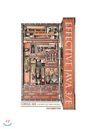

# Effective Java Study

💡 DEVOCEAN YOUNG 3기 Effective Java Study

# Study 기간
## 2024. 05 ~ 2024. 11

# Study Rules

### ✌️ Study 진행 도서

**Effective Java 3rd Edition**

### 📅 Study 일정

2주에 한번 Offline Meet UP (시험 기간에는 온라인 진행)

### 🙌 Study 방법

2주에 1개의 Chapter를 스터디 해오는 것이 목표.

스터디 한 내용은 GitHub Repo에 PR을 하여 Code Base로 문서를 관리.

Meet Up 때는 각 Chapter의 Item을 5개의 Part로 나누어 랜덤 발표 진행.

Code Base로 관리된 문서는 GitHub Page에 자동으로 배포 될 수 있도록 DevOps 작업 진행.

# 🤝 Member

> **우리의 목표 : Java를 잡아먹자. 🍓**
> 
|🎙️ **김경환 [Justin]**|😀 **이승연 [Mia]**|😀 **송가현 [Song]**|🐰 **조자영 [Jordy]**|😃 **한상호 [Thompson]**|
|-----------------------|-------------------|--------------------|----------------------|-----------------------|
||||||
|- Study Leader✨  - Github Publisher |- Study Member 🔥|- Study Member 🔥|- Study Member 🔥|- Study Member 🔥|
|<b>Profile</b>   - 00’s   - ENTJ 😎   - [GitHub](https://github.com/KyongHwan-Kim)|<b>Profile</b>   - 00’s   - ISTJ   - [GitHub](https://github.com/tmddus2)|<b>Profile</b>   - 02’s 막내   - INTJ   - [GitHub](https://github.com/SongGaHyeon)|<b>Profile</b> - 00’s - ENTJ - [GitHub](https://github.com/cho-ja-young)|<b>Profile</b>  - 00’s - ENTJ - [GitHub](https://github.com/bbbang105)|
|<b>Career</b>   - [LinkedIn](https://www.linkedin.com/in/kyounghwan-kim-kr1/)|🚧|<b>Career</b>  - [LinkedIn](https://www.linkedin.com/in/gahyeon-song-98243a63?utm_source=share&utm_campaign=share_via&utm_content=profile&utm_medium=ios_app)|🚧|<b>Career</b>   - Backend Developer|

<!--

**Here are some ideas to get you started:**

🙋‍♀️ A short introduction - what is your organization all about?
🌈 Contribution guidelines - how can the community get involved?
👩‍💻 Useful resources - where can the community find your docs? Is there anything else the community should know?
🍿 Fun facts - what does your team eat for breakfast?
🧙 Remember, you can do mighty things with the power of [Markdown](https://docs.github.com/github/writing-on-github/getting-started-with-writing-and-formatting-on-github/basic-writing-and-formatting-syntax)
-->
